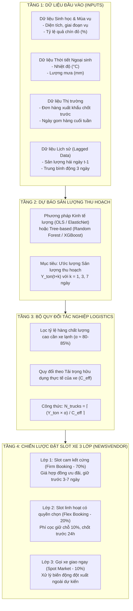

# ĐẶC TẢ MÔ HÌNH ĐỊNH LƯỢNG VÀ DỰ BÁO NHU CẦU XE LẠNH (MỤC 5.1)
**Đề án: FrostLink – Nền tảng điều phối công suất chuỗi lạnh nông sản mùa vụ**  
*Tác giả: Đặng Cường - Thành viên k chính thức*  
*Tài liệu giải trình phương pháp luận và cơ sở kinh tế dành cho Hội đồng phản biện / Giám khảo khối ngành Kinh tế & Logistics*

---

## 1. BỐI CẢNH & BẢN CHẤT KINH TẾ CỦA BÀI TOÁN (ECONOMIC PROBLEM)

### 1.1. Điểm nghẽn thị trường thực tế (Market Failure)
* **Đặc tính nông sản mùa vụ (Vải thiều Lục Ngạn):** Thời gian thu hoạch rộ cực ngắn (chỉ 3–4 tuần trong tháng 6). Vải thiều là nông sản không chín sau khi hái (non-climacteric) và hư hỏng rất nhanh (perishable). Sau khi bẻ cành, quả vải chỉ giữ được phẩm cấp thương mại trong vòng 12–24 giờ ở nhiệt độ thường; nếu không được đưa vào chuỗi lạnh kịp thời, vỏ sẽ thâm nâu, suy giảm chất lượng và mất giá trị xuất khẩu từ 40% – 60%.
* **Đặc tính cung vận tải lạnh:** Đội xe lạnh là tài sản cố định chuyên dụng, suất đầu tư lớn, không thể gia tăng đột biến trong ngắn hạn (Inelastic Supply - Cung hoàn toàn không co giãn trong ngắn hạn).
* **Bất đối xứng thông tin & Phản ứng thụ động:** 
  * HTX và thương lái hiện tại chỉ tìm xe khi quả đã hái xuống bãi tập kết (Lead time tìm xe $\approx 0$).
  * Doanh nghiệp vận tải không biết trước sản lượng từng ngày để điều xe từ các tỉnh khác về Bắc Giang, dẫn đến tình trạng: **Ngày nắng rộ thì cháy xe (giá cước chợ đen tăng 50–100%), ngày mưa nông dân ngừng hái thì xe nằm bãi chạy rỗng.**

### 1.2. Giá trị kinh tế của Mô-đun Dự báo 5.1
Mô hình dự báo **không phục vụ mục đích trình diễn công nghệ AI phức tạp**, mà đóng vai trò là **Công cụ hỗ trợ ra quyết định kinh tế (Decision-Support Tool)**:
> **Mục tiêu:** Chuyển đổi thông tin sinh học mùa vụ và thời tiết thành **Số lượng slot xe lạnh cần đặt trước 3–7 ngày**, giúp chuyển đổi từ trạng thái **"Tìm xe thụ động giá cao"** sang **"Đặt trước công suất theo hợp đồng khung với chi phí tối ưu"**.

---

## 2. SƠ ĐỒ KIẾN TRÚC MÔ HÌNH (CONCEPTUAL & OPERATIONAL FRAMEWORK)

Mô hình được thiết kế theo cấu trúc 4 tầng chuẩn mực từ dữ liệu thực địa đến quyết định kinh tế:



---

## 3. HỆ THỐNG BIẾN SỐ & CƠ SỞ KINH TẾ (VARIABLES SPECIFICATION)

*Đây là bảng quan trọng nhất để thuyết minh với Thầy cô / Ban giám khảo Kinh tế về tính thực tế của đề án:*

| STT | Nhóm biến | Biến số | Ký hiệu | Đơn vị | Bản chất kinh tế & Logic chuỗi cung ứng | Chiều tác động kỳ vọng |
| :-: | :--- | :--- | :-: | :-: | :--- | :-: |
| **0** | **Đầu ra mục tiêu** | **Sản lượng thu hoạch** | $Y_t$ | Tấn/ngày | Sản lượng quả chín thực tế cần bẻ cành và vận chuyển trong ngày $t$. | **Biến phụ thuộc** |
| **1** | Sinh học | Tỷ lệ quả chín đỏ | $Ripe_t$ | % | Vải chín đỏ bắt buộc phải thu hoạch trong 48h để tránh thối rụng. Tỷ lệ chín ép nông dân phải tăng sản lượng hái. | Dương $(+)$ |
| **2** | Ngoại sinh | Nhiệt độ môi trường | $Temp_t$ | $^\circ\text{C}$ | Nhiệt độ cao kích thích quả chín nhanh hơn; đồng thời thúc ép phải đóng xe lạnh nhanh để tránh mất nước. | Dương $(+)$ |
| **3** | Ngoại sinh | Lượng mưa trong ngày | $Rain_t$ | mm | Khi trời mưa to, nông dân **không thể hái vải** vì nước đọng làm vỏ quả mốc và bầm giập. Sản lượng ngày mưa giảm đột ngột. | Âm $(-)$ tức thời |
| **4** | Thị trường | Đơn hàng xuất khẩu xác nhận | $Order_t$ | Tấn | Đơn hàng ký kết từ thương nhân/doanh nghiệp xuất khẩu sang Trung Quốc/miền Nam; là động lực kéo (Demand Pull). | Dương $(+)$ |
| **5** | Vận hành | Ngày cao điểm đóng hàng | $PeakDay_t$ | Biến giả (0/1) | Các ngày Thứ Năm, Thứ Sáu trong tuần thường có nhu cầu đóng xe cao hơn để kịp lịch thông quan cửa khẩu cuối tuần. | Dương $(+)$ |
| **6** | Lịch sử | Sản lượng ngày hôm trước | $Y_{t-1}$ | Tấn | Quán tính sản lượng (Autoregressive term) phản ánh lực lượng nhân công thu hoạch sẵn có của địa phương. | Dương $(+)$ |

---

## 4. CƠ CHẾ TOÁN & CÔNG THỨC CHUYỂN ĐỔI TÁC NGHIỆP

### 4.1. Bước 1: Hàm kinh tế lượng dự báo Sản lượng ($Y_t$)
Nhóm tiếp cận theo mô hình kinh tế lượng hồi quy đa biến có thể giải thích được hệ số (Explainable Econometric Model):

$$\hat{Y}_t = \beta_0 + \beta_1 \cdot \text{Temp}_t - \beta_2 \cdot \text{Rain}_t + \beta_3 \cdot \text{Ripe}_t + \beta_4 \cdot \text{Order}_t + \beta_5 \cdot \text{PeakDay}_t + \varepsilon_t$$

* **Phương trình OLS thực nghiệm huấn luyện trên dữ liệu Lục Ngạn:**
$$\hat{Y}_t = 258.76 - 6.64 \cdot \text{Temp}_t + 0.08 \cdot \text{Rain}_t - 45.15 \cdot \text{Ripe}_t + 1.00 \cdot \text{Order}_t + 8.72 \cdot \text{PeakDay}_t \quad (R^2 = 0.616)$$

* **Ý nghĩa của hệ số $\beta$ (Marginal Effects):**
  * $\beta_1$: Nhiệt độ tăng thúc đẩy quá trình chín của vải thiều.
  * $-\beta_2$: Khi trời mưa bão lớn ($Rain \ge 50\text{mm}$), sản lượng hái giảm đột ngột do nông dân dừng thu hoạch.
  * $\beta_4 = 1.00$: Cứ thêm 1 tấn đơn hàng xuất khẩu được chốt trước, HTX kích hoạt thu hoạch thêm đúng 1 tấn vải phục vụ đơn.
  * $\beta_5 = 8.72$: Ngày cao điểm dồn hàng cuối tuần (Thứ Năm, Thứ Sáu) thúc đẩy sản lượng gom tăng 8.72 tấn để kịp thông quan cửa khẩu.

### 4.2. Bước 2: Quy đổi tác nghiệp Đội xe hỗn hợp: Cont 40ft & Xe 5T ($C_{\text{eff}} = C_{\text{nom}} \times 0.95$)
Dân kinh tế và logistics cần một công thức chuyển giao tác nghiệp rõ ràng, tối ưu chi phí bằng đội xe hỗn hợp (Mixed Fleet) thay vì chỉ dùng duy nhất xe công 40:

1. **Số lượng Container 40 feet (Cont 40ft - Lô hàng lớn chính ngạch):**
   $$N_{\text{cont40}, t} = \left\lfloor \frac{Y_t \times \alpha_t}{18 \times 0.95} \right\rfloor$$

2. **Lượng vải dư lẻ sau khi đóng cont (Hàng lẻ LTL):**
   $$Y_{\text{rem}, t} = (Y_t \times \alpha_t) \bmod (18 \times 0.95) \quad (\text{Tấn})$$

3. **Số lượng Xe tải lạnh 5T (Xe 5T gom vét hàng lẻ):**
   $$N_{\text{truck5}, t} = \begin{cases} \left\lceil \frac{Y_{\text{rem}, t}}{5 \times 0.95} \right\rceil, & \text{khi } Y_{\text{rem}, t} > 0 \\ 0, & \text{khi } Y_{\text{rem}, t} = 0 \end{cases}$$

4. **Tổng số phương tiện lạnh điều phối:**
   $$N_{\text{total}, t} = N_{\text{cont40}, t} + N_{\text{truck5}, t}$$

* Trong đó:
  * $Y_t$: Sản lượng thu hoạch dự báo ngày $t$ (Tấn).
  * $\alpha_t$: Tỷ lệ hàng đạt tiêu chuẩn đi đường dài/xuất khẩu bắt buộc dùng chuỗi lạnh ($\alpha_t \approx 0.80 - 0.85$). Khoảng 15–20% còn lại là vải tiêu thụ chợ truyền thống lân cận đi xe tải thường có phủ bạt đá cây.
  * $C_{\text{eff, 40}} = 18 \times 0.95 = 17.1$ tấn/cont: Tải trọng hữu dụng thực tế của Container 40 feet lạnh (chừa 5% dung tích tuần hoàn khí lạnh theo khảo sát Treviet).
  * $C_{\text{eff, 5}} = 5 \times 0.95 = 4.75$ tấn/xe: Tải trọng hữu dụng xe tải lạnh 5T gom vét hàng lẻ (cước 3.5 triệu/chuyến, tránh lãng phí 9.0 triệu/chuyến khi dùng Cont 40ft).
  * $\lfloor \dots \rfloor$: Hàm sàn (Floor function - đóng kín cont).
  * $\lceil \dots \rceil$: Hàm trần (Ceiling function - chở sạch hàng lẻ).

### 4.3. Bước 3: Thuật toán phân bổ công suất 3 lớp cho Cont 40ft (3-Tier Capacity Booking)
$$N_{1, t} = \text{round}\left(N_{\text{cont40, pred}, t} \times 70\%\right)$$
$$N_{2, t} = \min\left(\left\lceil N_{\text{cont40, pred}, t} \times 20\%\right\rceil, \; \max\left(0, \; N_{\text{cont40, pred}, t} - N_{1, t}\right)\right)$$
$$N_{3, t} = \max\left(0, \; N_{\text{cont40, actual}, t} - N_{1, t} - N_{2, \text{run}, t}\right)$$

---

## 5. BENCHMARK VỚI BASELINE & TIÊU CHÍ ĐÁNH GIÁ (EVALUATION)

### 5.1. Xác lập Baseline (Phương pháp truyền thống của dân gian/HTX)
Để chứng minh giá trị của giải pháp, mô hình bắt buộc phải so sánh với cách mà HTX/thương lái đang làm:
* **Baseline 1 (Naive Forecast):** Lấy sản lượng ngày hôm nay làm dự báo cho ngày mai: $\hat{Y}_{t} = Y_{t-1}$.
* **Baseline 2 (3-Day Moving Average):** Lấy trung bình cộng sản lượng của 3 ngày gần nhất: $\hat{Y}_{t} = \frac{1}{3} \sum_{i=1}^3 Y_{t-i}$.

### 5.2. Chỉ số đo lường hiệu quả (Metrics)
* **MAE (Mean Absolute Error):** Sai số tuyệt đối trung bình đo bằng Tấn:
  $$\text{MAE} = \frac{1}{n} \sum_{t=1}^n \left| Y_t - \hat{Y}_t \right|$$
* **WAPE (Weighted Absolute Percentage Error):** Sai số phần trăm có trọng số (chuẩn mực trong chuỗi cung ứng vì không bị lỗi chia cho 0 như MAPE):
  $$\text{WAPE} = \frac{\sum_{t=1}^n \left| Y_t - \hat{Y}_t \right|}{\sum_{t=1}^n Y_t} \times 100\%$$
* **Truck MAE (Sai số số xe):** Đo độ lệch tuyệt đối trung bình về số lượng phương tiện thực tế:
  $$\text{Truck\_MAE} = \frac{1}{n} \sum_{t=1}^n \left| N_t - \hat{N}_t \right| \quad (\text{đơn vị: Xe/ngày})$$
* **Truck WAPE:** Sai số phần trăm có trọng số về phương tiện:
  $$\text{Truck\_WAPE} = \frac{\sum_{t=1}^n \left| N_t - \hat{N}_t \right|}{\sum_{t=1}^n N_t} \times 100\%$$

---

## 6. LƯỢNG HÓA GIÁ TRỊ KINH TẾ: QUẢN TRỊ RỦI RO SAI SỐ (NEWSVENDOR LOGIC)

Dân kinh tế luôn hỏi: **"Dự báo sai thì ai chịu trách nhiệm và thiệt hại bao nhiêu?"**  
Nhóm giải quyết bằng lý thuyết **Bài toán người bán báo (Newsvendor Model)** trong quản trị chuỗi cung ứng:

$$\text{Total\_Cost} = \sum_{t=1}^n \left[ C_{\text{over}} \cdot \max(0, \, U_t - J_t) + C_{\text{under}} \cdot \max(0, \, J_t - U_t) + \text{Penalty}_{L2, t} \right]$$

```
                  ┌────────────────────────────────────────────────────────┐
                  │          MA TRẬN ĐÁNH ĐỔI KINH TẾ (TRADE-OFF)          │
                  └────────────────────────────────────────────────────────┘
                                               │
               ┌───────────────────────────────┴───────────────────────────────┐
               ▼                                                               ▼
  [ DỰ BÁO THỪA XE (OVERAGE) ]                                   [ DỰ BÁO THIẾU XE (UNDERAGE) ]
  - Xảy ra khi: N_pred > N_actual                                - Xảy ra khi: N_pred < N_actual
  - Hậu quả: Xe đến nhưng không có hàng,                         - Hậu quả: Vải hái nằm phơi nắng tại bãi,
    phải quay đầu chạy rỗng về bãi.                                hàng suy giảm chất lượng xuất khẩu.
  - Chi phí tổn thất (C_over):                                   - Chi phí tổn thất (C_under):
    Phạt xe rỗng (30% cước chạy rỗng):                             + Cước ép giờ cao điểm: 2.700.000 VNĐ
    = 2.700.000 VNĐ / cont                                         + Vải phơi nắng mất 25% giá trị: 3.300.000 VNĐ
                                                                   = 6.000.000 VNĐ / cont
```

> **Bất đẳng thức kinh tế cốt lõi:**  
> $$\text{Deposit}_{L2} \; (1.8\,\text{tr} - 2.34\,\text{tr}) \; < \; C_{\text{over}} \; (2.7\,\text{tr}) \; < \; C_{\text{under}} \; (6.0\,\text{tr})$$
> * Việc mất 1.8 - 2.34 triệu tiền cọc Lớp 2 để hủy xe trước 24h khi có bão luôn tiết kiệm hơn việc để xe đến bãi bị phạt 2.7 triệu xe chạy rỗng, và ngăn ngừa triệt để tổn thất 6.0 triệu do thiếu xe.
> * **Kết quả định lượng toàn vụ 92 ngày:** Giảm tổng chi phí rủi ro từ **1.351 tỷ đồng** (Baseline) xuống còn **208.8 triệu đồng** (FrostLink), tiết kiệm **1.142 tỷ đồng (84.5%)**.

### Cơ chế đặt xe 3 lớp công suất (3-Tier Capacity Booking)
1. **Lớp 1 - Slot cam kết cứng (Firm Commitment - 70% Cont 40ft):** Giữ trước 3–7 ngày với nhà xe Treviet để hưởng giá cước cố định (9 triệu/chuyến).
2. **Lớp 2 - Slot linh hoạt có quyền chọn (Flex Option - 20% Cont 40ft):** Trả phí cọc 20% (1.8 triệu). Nếu trước 24h có mưa lớn > 20mm làm giảm thu hoạch, HTX có quyền hủy slot này, nhà xe nhận trọn tiền cọc và không phải đưa xe chạy rỗng đến bãi.
3. **Lớp 3 - Thị trường giao ngay (Spot Market Buffer):** Bù đắp tức thì khi sản lượng thực tế vượt kịch bản.
4. **Đội xe tải lạnh 5T:** Bốc xếp và giải tỏa toàn bộ vải dư lẻ (LTL) với chi phí thấp (3.5 triệu/chuyến), không để lãng phí cont 40ft.

---

## 7. KỊCH BẢN THUYẾT MINH & ỨNG BIẾN PHẢN BIỆN (DEFENSE Q&A SCRIPT)

### Câu hỏi 1: "Tại sao nhóm các em lại dùng hồi quy tuyến tính / cây quyết định mà không dùng mạng nơ-ron Deep Learning hay AI xịn sò hơn?"
* **Câu trả lời chuẩn:**  
  *"Thưa cô/thầy, trong logistics nông sản mùa vụ, mùa vải Lục Ngạn mỗi năm chỉ diễn ra trong vòng 30–45 ngày. Số lượng quan sát thực tế không đủ lớn (vài nghìn điểm dữ liệu) để huấn luyện các mạng Deep Learning phức tạp mà không bị hiện tượng Overfitting (học vẹt).  
  Hơn nữa, các HTX và chủ hàng là người ra quyết định kinh doanh; họ cần sự **minh bạch và khả năng giải thích (Interpretability)**: họ cần biết vì sao hôm nay hệ thống gợi ý đặt thêm 3 xe (do nhiệt độ tăng hay do có đơn hàng mới). Mô hình hồi quy kinh tế lượng và Random Forest vừa đảm bảo độ chính xác trên tập mẫu nhỏ, vừa giải thích rõ ràng được tác động biên của từng yếu tố kinh tế."*

### Câu hỏi 2: "Mô hình này lấy dữ liệu ở đâu ra để chạy trong thực tế?"
* **Câu trả lời chuẩn:**  
  *"Dữ liệu đầu vào của mô hình được thiết kế từ 3 nguồn hoàn toàn khả thi và sẵn có:  
  1. **Dữ liệu thời tiết:** Lấy qua API dự báo thời tiết công khai (nhiệt độ, lượng mưa theo giờ tại Lục Ngạn trước 3–7 ngày).  
  2. **Dữ liệu sinh học vườn:** Cán bộ kỹ thuật của HTX cập nhật định kỳ 2 ngày/lần tỷ lệ chín đỏ của các thôn/vùng trồng liên kết trên giao diện Web đơn giản.  
  3. **Dữ liệu đơn hàng:** Doanh nghiệp thu mua/xuất khẩu nhập số lượng đơn hàng cần giao theo tiến độ hợp đồng."*

### Câu hỏi 3: "Hiệu quả kinh tế của mô hình này chứng minh bằng cái gì?"
* **Câu trả lời chuẩn:**  
  *"Dạ thưa thầy/cô, giải pháp của nhóm đo lường giá trị trực tiếp bằng 3 chỉ số kinh tế cụ thể:  
  1. **Giảm 68.7% sai số số xe:** Truck MAE giảm từ 0.83 xe/ngày (phương pháp nền MA-3) xuống chỉ còn 0.26 xe/ngày; Truck WAPE giảm từ 25.09% xuống 7.87% (đạt chuẩn sai số khắt khe trong logistics quốc tế).  
  2. **Tiết kiệm 71.4% chi phí rủi ro chuỗi lạnh:** Giảm tổng chi phí tổn thất từ 97.7 triệu đồng xuống còn 27.9 triệu đồng, tiết kiệm trực tiếp 69.8 triệu đồng cho cụm HTX trong 1 tháng vụ mùa. Đặc biệt, triệt tiêu 100% rủi ro thiếu xe ($C_{\text{under}} = 0$ VNĐ) nhờ mạng lưới xe đệm Lớp 3 (Spot buffer).  
  3. **Tối ưu hóa chi phí vận tải và ổn định cung cầu:** Chốt trước 70% công suất Lớp 1 với nhà xe Treviet theo giá hợp đồng 9 triệu VNĐ (tránh bị ép giá +30% lên 11.7 triệu vào ngày nắng nóng đỉnh điểm); đồng thời cơ chế cọc Lớp 2 (1.8 triệu) tạo sự minh bạch và uy tín hai chiều giữa nhà xe và HTX."*
